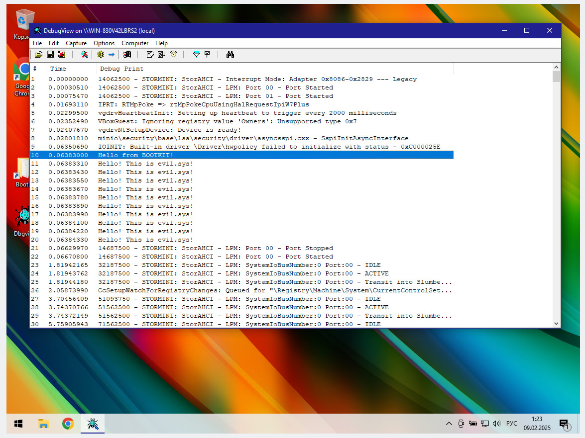
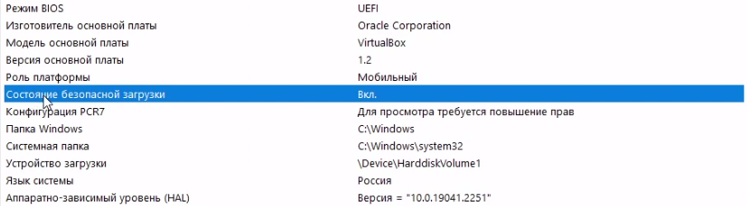
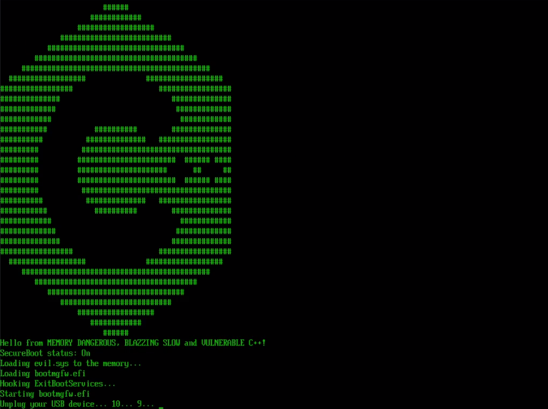
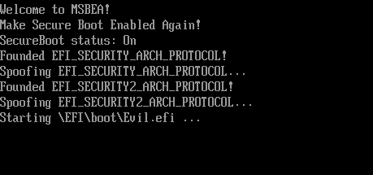

# Welcome to the UEFI Windows Bootkit with Secure Boot support :3

This is a Proof Of Concept of UEFI Windows Bootkit with Secure Boot support. You can use this project to make viruses which can work from kernel. DSE and PatchGuard bypassed also.

State of Secure Boot status: On

Security Protocol Spoofer "MSBEA" aka Make Secure Boot Enabled Again!

# Why I Did it?

I did it because I hate Windows. We must use GNU\Linux. 

Also I use C++ because I hate "memory safe" and "blazzing fast" Rust.

# How it works?

1. This POC use **shimx64.efi** and **mmx64.efi** from Ubuntu (I hate Ubuntu also. I use Arch Linux btw :3) to run **SecureBootBypass** aka **MSBEA** (**grubx64.efi**) in Secure Boot mode.
2. **MSBEA** spoof [EFI_SECURITY2_ARCH_PROTOCOL](https://github.com/tianocore/edk2/blob/master/MdePkg/Include/Protocol/Security2.h) and [EFI_SECURITY_ARCH_PROTOCOL](https://github.com/tianocore/edk2/blob/master/MdePkg/Include/Protocol/Security.h) to bypass authenticate check and run **Evil.efi** 
3. **Evil.efi** allocate memory for **evil.sys**, spoof [ExitBootServices](https://wikileaks.org/ciav7p1/cms/page_36896784.html) to get base address of **winload.efi** and SetVirtualAddressMap to convert address of allocated memory from **physical address** to **virtual address**.
4. From **ExitBootServices** **Evil.efi** hook [**OslArchTransferToKernel**](https://n4r1b.com/posts/2019/09/transition-from-an-efi-bootloader-to-the-kernel-in-windows-x64/). From **OslArchTrasferToKernel** **Evil.efi** infect **disk.sys** and [**Manual Map**](https://www.codereversing.com/archives/652) **evil.sys** driver.

# Supported systems

All Windows systems with UEFI and Secure Boot support. Windows 11 also.

# How to build?

1. You should clone this repo from github.
2. Build **drvtest** in this folder, replace driver binary header from **drvtest** to **HackingPkg**
3. Copy **HackingPkg** from this repo to [EDK2](https://github.com/tianocore/edk2) folder, configure EDK2 to this project and build.
4. Copy **shimx64.efi** and **mmx64.efi** from any Linux ISO installer to `EFI\boot\` in your USB storage. Rename **shimx64.efi** to **bootx64.efi**.
5. Copy **HackPackage.efi** and **SecureBootBypass.efi** to `EFI\boot` directory also. Rename **HackPackage.efi** to **Evil.efi**.
6. Use a special python script [**pe-add-sections.py**](https://github.com/rhboot/shim/issues/376) `./pe-add-sections.py -s .sbat <sbat csv file> -z .sbat -i <input file> -o <output file>` and add **sbat.csv** to **SecureBootBypass.efi** **.sbat** section and save result to **grubx64.efi**.

When you run this POC for the first time, **mmx64.efi** throw an error. You should **enroll hash** of **grubx64.efi** and reboot PC.

# For UnknownCheats and GuidedHacking users

If you use this project you should also spoof UEFI Runtime functions such as **GetVariable** and **GetNextVariableName** to hide **Moklist** variables.

Don't paste kids.

# Meme

[LMFAO DUDE](https://www.youtube.com/watch?v=s7wLYzRJt3s)

# VirusTotal

0 detects

https://www.virustotal.com/gui/file/3e6b77034d5c55c01410e289e130d1a88b26a0f4a51c701a2023a800a9573614

https://www.virustotal.com/gui/file/de705e83a56d059209a39204da38ad687368414fc4f54d289dd35ac2f83de8ea

# UPD

If you wanna use this project as a malware you must know how to hide thread after **PsCreateSystemThread** via **PspCidTable**

:3